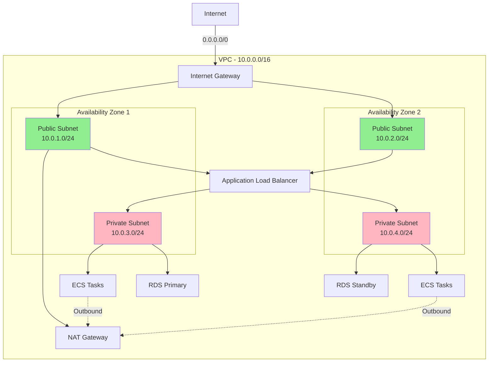

# Design Document: ECS Task Management API

## Overview

This design document provides a comprehensive architecture and step-by-step manual implementation guide for building a Task Management API on AWS ECS. The system demonstrates container orchestration, service discovery, load balancing, auto-scaling, database integration, JWT authentication, secrets management, and monitoring - all implemented manually through the AWS Console to maximize learning.

The architecture follows microservices patterns with two independent services (Auth Service and Task Service) running in ECS Fargate, fronted by an Application Load Balancer, backed by RDS PostgreSQL, with full observability through CloudWatch.

## Architecture

### High-Level Architecture Diagram

```mermaid
graph TB
    subgraph Internet
        User[User/Client]
    end
    
    subgraph "AWS Cloud - us-east-1"
        subgraph "Existing VPC"
            subgraph "Public Subnets"
                ALB[Application Load Balancer]
                NAT[NAT Gateway - Optional]
            end
            
            subgraph "Private Subnets"
                subgraph "ECS Cluster"
                    subgraph "Auth Service"
                        AuthTask1[Auth Task 1]
                        AuthTask2[Auth Task 2]
                    end
                    
                    subgraph "Task Service"
                        TaskTask1[Task Task 1]
                        TaskTask2[Task Task 2]
                    end
                end
                
                RDS[(RDS PostgreSQL)]
            end
            
            CloudMap[AWS Cloud Map<br/>Service Discovery]
        end
        
        ECR[Amazon ECR<br/>Container Registry]
        Secrets[AWS Secrets Manager]
        CloudWatch[Amazon CloudWatch<br/>Logs & Metrics]
    end
    
    User -->|HTTPS| ALB
    ALB -->|/auth/*| AuthTask1
    ALB -->|/auth/*| AuthTask2
    ALB -->|/tasks/*| TaskTask1
    ALB -->|/tasks/*| TaskTask2
    
    TaskTask1 -.->|Service Discovery| CloudMap
    TaskTask2 -.->|Service Discovery| CloudMap
    CloudMap -.->|Resolve Auth Service| AuthTask1
    CloudMap -.->|Resolve Auth Service| AuthTask2
    
    AuthTask1 -->|Read/Write| RDS
    AuthTask2 -->|Read/Write| RDS
    TaskTask1 -->|Read/Write| RDS
    TaskTask2 -->|Read/Write| RDS
    
    AuthTask1 -.->|Pull Secrets| Secrets
    AuthTask2 -.->|Pull Secrets| Secrets
    TaskTask1 -.->|Pull Secrets| Secrets
    TaskTask2 -.->|Pull Secrets| Secrets
    
    AuthTask1 -->|Push Logs| CloudWatch
    AuthTask2 -->|Push Logs| CloudWatch
    TaskTask1 -->|Push Logs| CloudWatch
    TaskTask2 -->|Push Logs| CloudWatch
    
    ECS Cluster -.->|Pull Images| ECR
    
    style ALB fill:#ff9900
    style RDS fill:#3b48cc
    style ECR fill:#ff9900
    style Secrets fill:#dd344c
    style CloudWatch fill:#ff9900
    style CloudMap fill:#ff9900
```

### Network Architecture



## Components and Interfaces

### 1. Application Load Balancer (ALB)

**Purpose**: Entry point for all external traffic, routes requests to appropriate services

**Configuration**:
- Scheme: Internet-facing
- IP address type: IPv4
- Listeners: HTTP (port 80), HTTPS (port 443)
- Target Groups: auth-service-tg, task-service-tg
- Health Check: /health endpoint, 30-second interval

**Routing Rules**:
```
/auth/*     → auth-service-tg (Auth Service)
/tasks/*    → task-service-tg (Task Service)
/health     → Both services
```

**Security Group (alb-sg)**:
- Inbound: 0.0.0.0/0 on port 80, 443
- Outbound: ECS security group on port 3000

### 2. ECS Cluster

**Purpose**: Container orchestration platform hosting both microservices

**Configuration**:
- Name: task-management-cluster
- Launch Type: AWS Fargate
- Container Insights: Enabled
- Region: us-east-1

**Services**:
1. auth-service (2 tasks minimum)
2. task-service (2 tasks minimum)

### 3. Auth Service

**Purpose**: Handles user authentication, JWT token generation and validation

**Container Specifications**:
- Image: {account-id}.dkr.ecr.us-east-1.amazonaws.com/auth-service:v1.0.0
- CPU: 256 (.25 vCPU)
- Memory: 512 MB
- Port: 3000

**Environment Variables** (from Secrets Manager):
- DB_HOST
- DB_PORT
- DB_NAME
- DB_USER
- DB_PASSWORD
- JWT_SECRET
- JWT_EXPIRATION=3600

**API Endpoints**:
```
POST   /auth/register    - Create new user account
POST   /auth/login       - Authenticate and receive JWT token
POST   /auth/validate    - Validate JWT token (internal)
GET    /auth/health      - Health check endpoint
```

**Database Schema**:
```sql
CREATE TABLE users (
    id SERIAL PRIMARY KEY,
    username VARCHAR(50) UNIQUE NOT NULL,
    email VARCHAR(100) UNIQUE NOT NULL,
    password_hash VARCHAR(255) NOT NULL,
    created_at TIMESTAMP DEFAULT CURRENT_TIMESTAMP,
    updated_at TIMESTAMP DEFAULT CURRENT_TIMESTAMP
);

CREATE INDEX idx_users_username ON users(username);
CREATE INDEX idx_users_email ON users(email);
```

**Security Group (auth-service-sg)**:
- Inbound: ALB security group on port 3000
- Inbound: Task service security group on port 3000 (for validation)
- Outbound: RDS security group on port 5432
- Outbound: 0.0.0.0/0 on port 443 (for AWS services)

### 4. Task Service

**Purpose**: Manages CRUD operations for tasks, validates authentication with Auth Service

**Container Specifications**:
- Image: {account-id}.dkr.ecr.us-east-1.amazonaws.com/task-service:v1.0.0
- CPU: 256 (.25 vCPU)
- Memory: 512 MB
- Port: 3000

**Environment Variables** (from Secrets Manager):
- DB_HOST
- DB_PORT
- DB_NAME
- DB_USER
- DB_PASSWORD
- AUTH_SERVICE_URL (from Service Discovery)

**API Endpoints**:
```
POST   /tasks           - Create new task (requires JWT)
GET    /tasks           - List all tasks for user (requires JWT)
GET    /tasks/:id       - Get specific task (requires JWT)
PUT    /tasks/:id       - Update task (requires JWT)
DELETE /tasks/:id       - Delete task (requires JWT)
GET    /tasks/health    - Health check endpoint
```

**Database Schema**:
```sql
CREATE TABLE tasks (
    id SERIAL PRIMARY KEY,
    user_id INTEGER NOT NULL REFERENCES users(id) ON DELETE CASCADE,
    title VARCHAR(200) NOT NULL,
    description TEXT,
    status VARCHAR(20) DEFAULT 'pending',
    priority VARCHAR(20) DEFAULT 'medium',
    due_date TIMESTAMP,
    created_at TIMESTAMP DEFAULT CURRENT_TIMESTAMP,
    updated_at TIMESTAMP DEFAULT CURRENT_TIMESTAMP
);

CREATE INDEX idx_tasks_user_id ON tasks(user_id);
CREATE INDEX idx_tasks_status ON tasks(status);
CREATE INDEX idx_tasks_due_date ON tasks(due_date);
```

**Security Group (task-service-sg)**:
- Inbound: ALB security group on port 3000
- Outbound: Auth service security group on port 3000
- Outbound: RDS security group on port 5432
- Outbound: 0.0.0.0/0 on port 443 (for AWS services)

### 5. AWS Cloud Map (Service Discovery)

**Purpose**: Enables Task Service to discover Auth Service dynamically

**Configuration**:
- Namespace: task-management.local (private DNS)
- Service: auth-service.task-management.local
- TTL: 60 seconds
- Health check: ECS native health checks

**DNS Resolution**:
```
auth-service.task-management.local → [Auth Task IPs]
```

### 6. RDS PostgreSQL

**Purpose**: Persistent data storage for users and tasks

**Configuration**:
- Engine: PostgreSQL 15.x
- Instance Class: db.t3.micro (free tier eligible)
- Storage: 20 GB GP2
- Multi-AZ: No (for learning, enable for production)
- Backup Retention: 7 days
- Automated Backups: Enabled
- Encryption: Enabled

**Connection Details**:
- Port: 5432
- Database Name: taskmanagement
- Master Username: dbadmin
- Master Password: Stored in Secrets Manager

**Security Group (rds-sg)**:
- Inbound: Auth service security group on port 5432
- Inbound: Task service security group on port 5432
- Outbound: None required

### 7. Amazon ECR (Container Registry)

**Purpose**: Store and version Docker images for both services

**Repositories**:
1. auth-service
2. task-service

**Configuration**:
- Scan on push: Enabled
- Tag immutability: Disabled (for learning)
- Lifecycle policy: Keep last 10 images
- Encryption: AES-256

### 8. AWS Secrets Manager

**Purpose**: Securely store and manage sensitive configuration

**Secrets**:
1. **rds-credentials**
   ```json
   {
     "username": "dbadmin",
     "password": "generated-secure-password",
     "host": "rds-endpoint.region.rds.amazonaws.com",
     "port": 5432,
     "dbname": "taskmanagement"
   }
   ```

2. **jwt-secret**
   ```json
   {
     "secret": "generated-256-bit-key",
     "expiration": "3600"
   }
   ```

**IAM Policy for ECS Task Execution Role**:
```json
{
  "Version": "2012-10-17",
  "Statement": [
    {
      "Effect": "Allow",
      "Action": [
        "secretsmanager:GetSecretValue"
      ],
      "Resource": [
        "arn:aws:secretsmanager:us-east-1:*:secret:rds-credentials-*",
        "arn:aws:secretsmanager:us-east-1:*:secret:jwt-secret-*"
      ]
    }
  ]
}
```

### 9. CloudWatch Logs and Metrics

**Purpose**: Centralized logging and monitoring for all services

**Log Groups**:
- /ecs/auth-service (retention: 30 days)
- /ecs/task-service (retention: 30 days)

**Custom Metrics**:
- RequestCount (per service)
- ErrorRate (per service)
- ResponseTime (per service)
- ActiveConnections (RDS)

**Alarms**:
1. **High Error Rate**: Error rate > 5% for 5 minutes
2. **High CPU**: Service CPU > 70% for 5 minutes
3. **Database Connections**: RDS connections > 80% of max
4. **Task Health**: Unhealthy task count > 0 for 2 minutes

### 10. Auto Scaling Configuration

**Target Tracking Policies**:

**Auth Service Scaling**:
- Metric: Average CPU Utilization
- Target: 70%
- Scale-out cooldown: 60 seconds
- Scale-in cooldown: 300 seconds
- Min tasks: 2
- Max tasks: 10

**Task Service Scaling**:
- Metric: Average CPU Utilization
- Target: 70%
- Scale-out cooldown: 60 seconds
- Scale-in cooldown: 300 seconds
- Min tasks: 2
- Max tasks: 10

## Data Models

### User Model
```typescript
interface User {
  id: number;
  username: string;
  email: string;
  password_hash: string;
  created_at: Date;
  updated_at: Date;
}
```

### Task Model
```typescript
interface Task {
  id: number;
  user_id: number;
  title: string;
  description?: string;
  status: 'pending' | 'in_progress' | 'completed';
  priority: 'low' | 'medium' | 'high';
  due_date?: Date;
  created_at: Date;
  updated_at: Date;
}
```

### JWT Token Payload
```typescript
interface JWTPayload {
  user_id: number;
  username: string;
  email: string;
  iat: number;  // issued at
  exp: number;  // expiration
}
```

## Correctness Properties

*A property is a characteristic or behavior that should hold true across all valid executions of a system—essentially, a formal statement about what the system should do. Properties serve as the bridge between human-readable specifications and machine-verifiable correctness guarantees.*


### Property Reflection

After analyzing all acceptance criteria, I identified the following testable properties. Now reviewing for redundancy:

**Testable Properties Identified:**
- 2.2: Service discovery resolution
- 6.1: JWT generation with expiration
- 6.2: Token validation before processing
- 6.3: Password hashing
- 6.5: JWT token claims
- 5.4: Connection pooling
- 5.5: User data persistence
- 10.1: Task creation
- 10.2: User-specific task retrieval
- 10.3: Task update authorization
- 10.4: Task delete authorization

**Redundancy Analysis:**
- Properties 6.1 and 6.5 can be combined: JWT generation should include both expiration AND required claims
- Properties 10.3 and 10.4 test the same authorization pattern (owner-only operations) - can be combined into one property about authorization
- Property 5.5 is subsumed by 10.1 and 10.2 (if tasks persist correctly, user data persistence is validated)
- Property 5.4 (connection pooling) is an implementation detail, not a functional correctness property

**Properties to Keep:**
1. JWT generation with expiration and claims (combines 6.1 + 6.5)
2. Token validation before processing (6.2)
3. Password hashing (6.3)
4. Service discovery resolution (2.2)
5. Task creation (10.1)
6. User-specific task retrieval (10.2)
7. Owner-only operations (combines 10.3 + 10.4)

### Correctness Properties

**Property 1: JWT Token Generation Completeness**

*For any* valid user credentials, when authentication succeeds, the generated JWT token should contain user_id, username, email claims and have an expiration time of exactly 3600 seconds from issuance.

**Validates: Requirements 6.1, 6.5**

---

**Property 2: Authentication Required for Protected Endpoints**

*For any* request to a protected endpoint (/tasks/*), the Task Service should validate the JWT token with the Auth Service before processing the request, and reject requests without valid tokens.

**Validates: Requirements 6.2**

---

**Property 3: Password Security**

*For any* user registration or password change, the stored password in the database should be a bcrypt hash and never match the plaintext password.

**Validates: Requirements 6.3**

---

**Property 4: Service Discovery Resolution**

*For any* inter-service communication attempt, the Task Service should successfully resolve the Auth Service endpoint through AWS Cloud Map service discovery.

**Validates: Requirements 2.2**

---

**Property 5: Task Creation Persistence**

*For any* valid task data with authentication, creating a task should result in the task being stored in the database and retrievable with the same attributes.

**Validates: Requirements 10.1**

---

**Property 6: User Task Isolation**

*For any* authenticated user, retrieving tasks should return only tasks that belong to that user and never include tasks from other users.

**Validates: Requirements 10.2**

---

**Property 7: Owner-Only Modifications**

*For any* task modification or deletion request, the operation should succeed only if the authenticated user is the owner of the task, otherwise return 403 Forbidden.

**Validates: Requirements 10.3, 10.4**

---

## Error Handling

### Authentication Errors

**Invalid Credentials (401)**:
```json
{
  "error": "Unauthorized",
  "message": "Invalid username or password"
}
```

**Expired Token (401)**:
```json
{
  "error": "Unauthorized",
  "message": "Token has expired"
}
```

**Missing Token (401)**:
```json
{
  "error": "Unauthorized",
  "message": "No authentication token provided"
}
```

### Authorization Errors

**Forbidden Resource (403)**:
```json
{
  "error": "Forbidden",
  "message": "You do not have permission to access this resource"
}
```

### Validation Errors

**Invalid Input (400)**:
```json
{
  "error": "Bad Request",
  "message": "Validation failed",
  "details": [
    {
      "field": "title",
      "message": "Title is required"
    }
  ]
}
```

### Resource Errors

**Not Found (404)**:
```json
{
  "error": "Not Found",
  "message": "Task with id 123 not found"
}
```

### Server Errors

**Internal Server Error (500)**:
```json
{
  "error": "Internal Server Error",
  "message": "An unexpected error occurred"
}
```

**Service Unavailable (503)**:
```json
{
  "error": "Service Unavailable",
  "message": "Database connection failed"
}
```

### Error Handling Strategy

1. **Graceful Degradation**: Services should handle downstream failures gracefully
2. **Retry Logic**: Implement exponential backoff for transient failures
3. **Circuit Breaker**: Prevent cascading failures when Auth Service is down
4. **Logging**: Log all errors with correlation IDs for tracing
5. **User-Friendly Messages**: Never expose internal error details to clients

## Testing Strategy

This project uses a dual testing approach combining unit tests and property-based tests to ensure comprehensive coverage and correctness.

### Unit Testing

Unit tests verify specific examples, edge cases, and error conditions. They are valuable for:
- Testing specific authentication scenarios (valid login, invalid password, missing fields)
- Verifying error responses (401, 403, 404, 500)
- Testing database connection handling
- Validating request/response formats
- Testing health check endpoints

**Example Unit Tests**:
```typescript
// Auth Service
- POST /auth/register with valid data returns 201
- POST /auth/login with invalid password returns 401
- POST /auth/login with non-existent user returns 401
- GET /auth/health returns 200

// Task Service
- GET /tasks without token returns 401
- POST /tasks with expired token returns 401
- DELETE /tasks/:id for non-owner returns 403
- GET /tasks/:id for non-existent task returns 404
```

### Property-Based Testing

Property-based tests verify universal properties across many randomly generated inputs. Each property test should run a minimum of 100 iterations to ensure comprehensive coverage.

**Testing Framework**: Use `fast-check` for Node.js/TypeScript or `hypothesis` for Python

**Property Test Configuration**:
- Minimum iterations: 100 per test
- Each test must reference its design document property
- Tag format: `Feature: ecs-task-management-api, Property {number}: {property_text}`

**Property Tests to Implement**:

1. **Property 1: JWT Token Generation Completeness**
   - Generate random valid user credentials
   - Verify token contains all required claims
   - Verify expiration is exactly 3600 seconds
   - Tag: `Feature: ecs-task-management-api, Property 1: JWT Token Generation Completeness`

2. **Property 2: Authentication Required for Protected Endpoints**
   - Generate random requests with/without tokens
   - Verify all protected endpoints validate tokens
   - Tag: `Feature: ecs-task-management-api, Property 2: Authentication Required for Protected Endpoints`

3. **Property 3: Password Security**
   - Generate random passwords
   - Verify stored hash never matches plaintext
   - Verify bcrypt format
   - Tag: `Feature: ecs-task-management-api, Property 3: Password Security`

4. **Property 4: Service Discovery Resolution**
   - Generate random service discovery requests
   - Verify Auth Service endpoint resolution
   - Tag: `Feature: ecs-task-management-api, Property 4: Service Discovery Resolution`

5. **Property 5: Task Creation Persistence**
   - Generate random valid task data
   - Verify round-trip (create then retrieve)
   - Tag: `Feature: ecs-task-management-api, Property 5: Task Creation Persistence`

6. **Property 6: User Task Isolation**
   - Generate random users and tasks
   - Verify users only see their own tasks
   - Tag: `Feature: ecs-task-management-api, Property 6: User Task Isolation`

7. **Property 7: Owner-Only Modifications**
   - Generate random task modification attempts
   - Verify only owners can modify/delete
   - Tag: `Feature: ecs-task-management-api, Property 7: Owner-Only Modifications`

### Integration Testing

Integration tests verify end-to-end flows:
- User registration → login → create task → retrieve task → delete task
- Token validation flow between Task Service and Auth Service
- Database connection and query execution
- Service discovery and inter-service communication

### Testing Balance

- **Unit tests**: Focus on specific examples and edge cases (20-30 tests)
- **Property tests**: Focus on universal properties (7 tests, 100+ iterations each)
- **Integration tests**: Focus on end-to-end workflows (5-10 tests)

Together, these provide comprehensive coverage where unit tests catch concrete bugs and property tests verify general correctness.


---

## Manual Implementation Guide

A comprehensive step-by-step implementation guide is provided in a separate document: `implementation-guide.md`

The guide covers:

1. **Phase 1: Foundation Setup** - VPC verification, security groups, IAM roles
2. **Phase 2: Database Setup** - RDS PostgreSQL, Secrets Manager, database schema
3. **Phase 3: Container Images** - Building and pushing Docker images to ECR
4. **Phase 4: ECS Cluster Setup** - Creating cluster, log groups, service discovery
5. **Phase 5: Deploy Services** - Task definitions and ECS service deployment
6. **Phase 6: Load Balancer Setup** - ALB configuration and routing rules
7. **Phase 7: Auto Scaling and Monitoring** - Scaling policies, alarms, dashboards
8. **Phase 8: Testing and Validation** - End-to-end testing of all functionality
9. **Phase 9: Cleanup** - Resource cleanup to avoid charges

Each phase includes:
- Clear objectives
- Step-by-step AWS Console instructions
- Verification checkpoints
- Expected outcomes
- Troubleshooting tips

**Estimated Implementation Time**: 4-6 hours

**Learning Outcomes**: Hands-on experience with ECS, service discovery, load balancing, auto-scaling, RDS integration, secrets management, and CloudWatch monitoring.

See `implementation-guide.md` for complete details.
