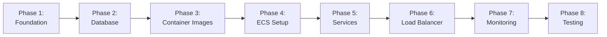

# AWS ECS Task Management API - Manual Implementation Guide

## Overview

This guide provides step-by-step instructions for manually implementing the Task Management API on AWS ECS. Follow these steps sequentially to build a complete understanding of container orchestration, service discovery, load balancing, and AWS services integration.

**Estimated Time**: 4-6 hours
**AWS Region**: us-east-1
**Prerequisites**: 
- AWS account with credits
- Existing VPC in us-east-1
- Basic understanding of Docker
- AWS CLI installed (optional but helpful)

## Implementation Phases



---

## Phase 1: Foundation Setup (30 minutes)

### Step 1.1: Verify VPC Configuration

**Goal**: Understand your existing VPC structure

1. Navigate to **VPC Console** → **Your VPCs**
2. Select your VPC in us-east-1
3. Note down:
   - VPC ID: `vpc-xxxxxxxxx`
   - CIDR block: `10.0.0.0/16` (example)
4. Go to **Subnets**
5. Identify and note:
   - **Public Subnets** (2 in different AZs): `subnet-pub-1a`, `subnet-pub-1b`
   - **Private Subnets** (2 in different AZs): `subnet-priv-1a`, `subnet-priv-1b`
6. Verify **Internet Gateway** is attached to VPC
7. Check **Route Tables**:
   - Public subnets should route 0.0.0.0/0 to Internet Gateway
   - Private subnets should route 0.0.0.0/0 to NAT Gateway (if exists)

**Verification**: You should have 2 public and 2 private subnets in different availability zones.

### Step 1.2: Create Security Groups

**Goal**: Set up network security boundaries

**1.2.1: ALB Security Group**

1. Navigate to **EC2 Console** → **Security Groups** → **Create security group**
2. Configuration:
   - Name: `task-mgmt-alb-sg`
   - Description: `Security group for Application Load Balancer`
   - VPC: Select your VPC
3. **Inbound Rules**:
   - Type: HTTP, Port: 80, Source: 0.0.0.0/0
   - Type: HTTPS, Port: 443, Source: 0.0.0.0/0
4. **Outbound Rules**: Leave default (all traffic)
5. Click **Create security group**
6. **Note the Security Group ID**: `sg-alb-xxxxxxxxx`

**1.2.2: Auth Service Security Group**

1. Create security group:
   - Name: `task-mgmt-auth-sg`
   - Description: `Security group for Auth Service`
   - VPC: Select your VPC
2. **Inbound Rules**:
   - Type: Custom TCP, Port: 3000, Source: `sg-alb-xxxxxxxxx` (ALB SG)
   - Type: Custom TCP, Port: 3000, Source: `task-mgmt-task-sg` (will create next)
3. **Outbound Rules**: Leave default
4. **Note the Security Group ID**: `sg-auth-xxxxxxxxx`

**1.2.3: Task Service Security Group**

1. Create security group:
   - Name: `task-mgmt-task-sg`
   - Description: `Security group for Task Service`
   - VPC: Select your VPC
2. **Inbound Rules**:
   - Type: Custom TCP, Port: 3000, Source: `sg-alb-xxxxxxxxx` (ALB SG)
3. **Outbound Rules**: Leave default
4. **Note the Security Group ID**: `sg-task-xxxxxxxxx`

**1.2.4: Update Auth Service Security Group**

1. Go back to `task-mgmt-auth-sg`
2. Edit inbound rules
3. Add: Type: Custom TCP, Port: 3000, Source: `sg-task-xxxxxxxxx`

**1.2.5: RDS Security Group**

1. Create security group:
   - Name: `task-mgmt-rds-sg`
   - Description: `Security group for RDS PostgreSQL`
   - VPC: Select your VPC
2. **Inbound Rules**:
   - Type: PostgreSQL, Port: 5432, Source: `sg-auth-xxxxxxxxx`
   - Type: PostgreSQL, Port: 5432, Source: `sg-task-xxxxxxxxx`
3. **Outbound Rules**: Leave default
4. **Note the Security Group ID**: `sg-rds-xxxxxxxxx`

**Verification**: You should have 4 security groups with proper ingress/egress rules.

### Step 1.3: Create IAM Roles

**Goal**: Set up permissions for ECS tasks

**1.3.1: ECS Task Execution Role**

1. Navigate to **IAM Console** → **Roles** → **Create role**
2. Select **AWS service** → **Elastic Container Service** → **Elastic Container Service Task**
3. Click **Next**
4. Attach policies:
   - `AmazonECSTaskExecutionRolePolicy` (AWS managed)
5. Click **Next**
6. Role name: `ecsTaskExecutionRole`
7. Click **Create role**
8. Select the created role
9. Click **Add permissions** → **Create inline policy**
10. JSON policy:
```json
{
  "Version": "2012-10-17",
  "Statement": [
    {
      "Effect": "Allow",
      "Action": [
        "secretsmanager:GetSecretValue",
        "kms:Decrypt"
      ],
      "Resource": [
        "arn:aws:secretsmanager:us-east-1:*:secret:task-mgmt-*"
      ]
    }
  ]
}
```
11. Policy name: `SecretsManagerAccess`
12. Click **Create policy**

**1.3.2: ECS Task Role**

1. Create another role
2. Select **AWS service** → **Elastic Container Service** → **Elastic Container Service Task**
3. Don't attach any policies yet
4. Role name: `ecsTaskRole`
5. Click **Create role**
6. Add inline policy:
```json
{
  "Version": "2012-10-17",
  "Statement": [
    {
      "Effect": "Allow",
      "Action": [
        "logs:CreateLogStream",
        "logs:PutLogEvents"
      ],
      "Resource": "arn:aws:logs:us-east-1:*:log-group:/ecs/*"
    }
  ]
}
```
7. Policy name: `CloudWatchLogsAccess`

**Verification**: You should have 2 IAM roles: `ecsTaskExecutionRole` and `ecsTaskRole`.

---

## Phase 2: Database Setup (30 minutes)

### Step 2.1: Create RDS Subnet Group

**Goal**: Define where RDS can be deployed

1. Navigate to **RDS Console** → **Subnet groups** → **Create DB subnet group**
2. Configuration:
   - Name: `task-mgmt-db-subnet-group`
   - Description: `Subnet group for task management database`
   - VPC: Select your VPC
3. **Add subnets**:
   - Select both availability zones
   - Select both **private subnets**
4. Click **Create**

**Verification**: Subnet group should show 2 subnets in different AZs.

### Step 2.2: Create Secrets in Secrets Manager

**Goal**: Store database credentials securely

1. Navigate to **Secrets Manager** → **Store a new secret**
2. Secret type: **Other type of secret**
3. Key/value pairs:
   ```
   username: dbadmin
   password: [Generate secure password - click "Generate random password"]
   ```
4. Click **Next**
5. Secret name: `task-mgmt-rds-credentials`
6. Description: `Database credentials for task management API`
7. Click **Next** → **Next** → **Store**
8. **Note the Secret ARN**: `arn:aws:secretsmanager:us-east-1:xxx:secret:task-mgmt-rds-credentials-xxx`

**Create JWT Secret**:

1. Store another secret
2. Key/value pairs:
   ```
   secret: [Generate random 64-character string]
   expiration: 3600
   ```
3. Secret name: `task-mgmt-jwt-secret`
4. **Note the Secret ARN**

**Verification**: You should have 2 secrets in Secrets Manager.

### Step 2.3: Create RDS PostgreSQL Instance

**Goal**: Set up managed database

1. Navigate to **RDS Console** → **Databases** → **Create database**
2. **Engine options**:
   - Engine type: PostgreSQL
   - Version: PostgreSQL 15.x (latest)
3. **Templates**: Free tier (or Dev/Test)
4. **Settings**:
   - DB instance identifier: `task-mgmt-db`
   - Master username: `dbadmin`
   - Master password: Use the password from Secrets Manager
5. **Instance configuration**:
   - DB instance class: db.t3.micro
6. **Storage**:
   - Storage type: General Purpose SSD (gp2)
   - Allocated storage: 20 GB
   - Disable storage autoscaling (for learning)
7. **Connectivity**:
   - VPC: Select your VPC
   - DB subnet group: `task-mgmt-db-subnet-group`
   - Public access: No
   - VPC security group: Choose existing → `task-mgmt-rds-sg`
   - Availability Zone: No preference
8. **Database authentication**: Password authentication
9. **Additional configuration**:
   - Initial database name: `taskmanagement`
   - Backup retention: 7 days
   - Enable encryption
10. Click **Create database**

**Wait**: Database creation takes 5-10 minutes

**Verification**: 
1. Database status should be "Available"
2. Note the **Endpoint**: `task-mgmt-db.xxxxxxxxx.us-east-1.rds.amazonaws.com`
3. Port should be 5432

### Step 2.4: Update Secrets with RDS Endpoint

1. Go back to **Secrets Manager**
2. Select `task-mgmt-rds-credentials`
3. Click **Retrieve secret value** → **Edit**
4. Add new key/value pairs:
   ```
   host: [Your RDS endpoint]
   port: 5432
   dbname: taskmanagement
   ```
5. Click **Save**

**Verification**: Secret should now have 5 key/value pairs.

---

## Phase 3: Container Images (45 minutes)

### Step 3.1: Create ECR Repositories

**Goal**: Set up container registries

1. Navigate to **ECR Console** → **Repositories** → **Create repository**
2. **Auth Service Repository**:
   - Visibility: Private
   - Repository name: `task-mgmt-auth-service`
   - Tag immutability: Disabled
   - Scan on push: Enabled
   - Encryption: AES-256
3. Click **Create repository**
4. **Note the URI**: `123456789012.dkr.ecr.us-east-1.amazonaws.com/task-mgmt-auth-service`

5. Create another repository:
   - Repository name: `task-mgmt-task-service`
   - Same settings as above
6. **Note the URI**

**Verification**: You should have 2 ECR repositories.

### Step 3.2: Build Auth Service Container

**Goal**: Create and push Auth Service Docker image

**Create Auth Service Code** (on your local machine):

1. Create directory: `mkdir auth-service && cd auth-service`
2. Create `package.json`:
```json
{
  "name": "auth-service",
  "version": "1.0.0",
  "main": "index.js",
  "scripts": {
    "start": "node index.js"
  },
  "dependencies": {
    "express": "^4.18.2",
    "pg": "^8.11.0",
    "bcrypt": "^5.1.1",
    "jsonwebtoken": "^9.0.2",
    "dotenv": "^16.3.1"
  }
}
```

3. Create `index.js`:
```javascript
const express = require('express');
const { Pool } = require('pg');
const bcrypt = require('bcrypt');
const jwt = require('jsonwebtoken');

const app = express();
app.use(express.json());

// Database connection
const pool = new Pool({
  host: process.env.DB_HOST,
  port: process.env.DB_PORT,
  database: process.env.DB_NAME,
  user: process.env.DB_USER,
  password: process.env.DB_PASSWORD,
  max: 20,
  idleTimeoutMillis: 30000,
  connectionTimeoutMillis: 2000,
});

// Health check
app.get('/auth/health', (req, res) => {
  res.json({ status: 'healthy', service: 'auth' });
});

// Register endpoint
app.post('/auth/register', async (req, res) => {
  try {
    const { username, email, password } = req.body;
    
    if (!username || !email || !password) {
      return res.status(400).json({ error: 'Bad Request', message: 'Missing required fields' });
    }

    const passwordHash = await bcrypt.hash(password, 10);
    
    const result = await pool.query(
      'INSERT INTO users (username, email, password_hash) VALUES ($1, $2, $3) RETURNING id, username, email, created_at',
      [username, email, passwordHash]
    );
    
    res.status(201).json({ user: result.rows[0] });
  } catch (error) {
    console.error('Registration error:', error);
    if (error.code === '23505') {
      return res.status(400).json({ error: 'Bad Request', message: 'Username or email already exists' });
    }
    res.status(500).json({ error: 'Internal Server Error', message: 'Registration failed' });
  }
});

// Login endpoint
app.post('/auth/login', async (req, res) => {
  try {
    const { username, password } = req.body;
    
    if (!username || !password) {
      return res.status(400).json({ error: 'Bad Request', message: 'Missing credentials' });
    }

    const result = await pool.query('SELECT * FROM users WHERE username = $1', [username]);
    
    if (result.rows.length === 0) {
      return res.status(401).json({ error: 'Unauthorized', message: 'Invalid username or password' });
    }

    const user = result.rows[0];
    const validPassword = await bcrypt.compare(password, user.password_hash);
    
    if (!validPassword) {
      return res.status(401).json({ error: 'Unauthorized', message: 'Invalid username or password' });
    }

    const token = jwt.sign(
      { user_id: user.id, username: user.username, email: user.email },
      process.env.JWT_SECRET,
      { expiresIn: parseInt(process.env.JWT_EXPIRATION || '3600') }
    );
    
    res.json({ token, user: { id: user.id, username: user.username, email: user.email } });
  } catch (error) {
    console.error('Login error:', error);
    res.status(500).json({ error: 'Internal Server Error', message: 'Login failed' });
  }
});

// Validate token endpoint (internal)
app.post('/auth/validate', async (req, res) => {
  try {
    const token = req.headers.authorization?.replace('Bearer ', '');
    
    if (!token) {
      return res.status(401).json({ error: 'Unauthorized', message: 'No token provided' });
    }

    const decoded = jwt.verify(token, process.env.JWT_SECRET);
    res.json({ valid: true, user: decoded });
  } catch (error) {
    if (error.name === 'TokenExpiredError') {
      return res.status(401).json({ error: 'Unauthorized', message: 'Token has expired' });
    }
    res.status(401).json({ error: 'Unauthorized', message: 'Invalid token' });
  }
});

const PORT = process.env.PORT || 3000;
app.listen(PORT, () => {
  console.log(`Auth service listening on port ${PORT}`);
});
```

4. Create `Dockerfile`:
```dockerfile
FROM node:18-alpine

WORKDIR /app

COPY package*.json ./
RUN npm install --production

COPY . .

EXPOSE 3000

CMD ["node", "index.js"]
```

5. Create `.dockerignore`:
```
node_modules
npm-debug.log
.env
.git
```

**Build and Push to ECR**:

1. Authenticate Docker to ECR:
```bash
aws ecr get-login-password --region us-east-1 | docker login --username AWS --password-stdin 123456789012.dkr.ecr.us-east-1.amazonaws.com
```

2. Build image:
```bash
docker build -t task-mgmt-auth-service .
```

3. Tag image:
```bash
docker tag task-mgmt-auth-service:latest 123456789012.dkr.ecr.us-east-1.amazonaws.com/task-mgmt-auth-service:v1.0.0
```

4. Push to ECR:
```bash
docker push 123456789012.dkr.ecr.us-east-1.amazonaws.com/task-mgmt-auth-service:v1.0.0
```

**Verification**: Check ECR console - you should see the image with tag v1.0.0.

### Step 3.3: Build Task Service Container

**Create Task Service Code**:

1. Create directory: `cd .. && mkdir task-service && cd task-service`
2. Create `package.json`:
```json
{
  "name": "task-service",
  "version": "1.0.0",
  "main": "index.js",
  "scripts": {
    "start": "node index.js"
  },
  "dependencies": {
    "express": "^4.18.2",
    "pg": "^8.11.0",
    "axios": "^1.6.0",
    "dotenv": "^16.3.1"
  }
}
```

3. Create `index.js`:
```javascript
const express = require('express');
const { Pool } = require('pg');
const axios = require('axios');

const app = express();
app.use(express.json());

// Database connection
const pool = new Pool({
  host: process.env.DB_HOST,
  port: process.env.DB_PORT,
  database: process.env.DB_NAME,
  user: process.env.DB_USER,
  password: process.env.DB_PASSWORD,
  max: 20,
  idleTimeoutMillis: 30000,
  connectionTimeoutMillis: 2000,
});

// Middleware to validate JWT
async function authenticateToken(req, res, next) {
  const token = req.headers.authorization;
  
  if (!token) {
    return res.status(401).json({ error: 'Unauthorized', message: 'No authentication token provided' });
  }

  try {
    const response = await axios.post(
      `${process.env.AUTH_SERVICE_URL}/auth/validate`,
      {},
      { headers: { Authorization: token } }
    );
    
    req.user = response.data.user;
    next();
  } catch (error) {
    if (error.response?.status === 401) {
      return res.status(401).json({ error: 'Unauthorized', message: error.response.data.message });
    }
    console.error('Token validation error:', error);
    res.status(500).json({ error: 'Internal Server Error', message: 'Authentication failed' });
  }
}

// Health check
app.get('/tasks/health', (req, res) => {
  res.json({ status: 'healthy', service: 'task' });
});

// Create task
app.post('/tasks', authenticateToken, async (req, res) => {
  try {
    const { title, description, status, priority, due_date } = req.body;
    
    if (!title) {
      return res.status(400).json({ error: 'Bad Request', message: 'Title is required' });
    }

    const result = await pool.query(
      'INSERT INTO tasks (user_id, title, description, status, priority, due_date) VALUES ($1, $2, $3, $4, $5, $6) RETURNING *',
      [req.user.user_id, title, description || null, status || 'pending', priority || 'medium', due_date || null]
    );
    
    res.status(201).json({ task: result.rows[0] });
  } catch (error) {
    console.error('Create task error:', error);
    res.status(500).json({ error: 'Internal Server Error', message: 'Failed to create task' });
  }
});

// Get all tasks for user
app.get('/tasks', authenticateToken, async (req, res) => {
  try {
    const result = await pool.query(
      'SELECT * FROM tasks WHERE user_id = $1 ORDER BY created_at DESC',
      [req.user.user_id]
    );
    
    res.json({ tasks: result.rows });
  } catch (error) {
    console.error('Get tasks error:', error);
    res.status(500).json({ error: 'Internal Server Error', message: 'Failed to retrieve tasks' });
  }
});

// Get specific task
app.get('/tasks/:id', authenticateToken, async (req, res) => {
  try {
    const result = await pool.query(
      'SELECT * FROM tasks WHERE id = $1 AND user_id = $2',
      [req.params.id, req.user.user_id]
    );
    
    if (result.rows.length === 0) {
      return res.status(404).json({ error: 'Not Found', message: `Task with id ${req.params.id} not found` });
    }
    
    res.json({ task: result.rows[0] });
  } catch (error) {
    console.error('Get task error:', error);
    res.status(500).json({ error: 'Internal Server Error', message: 'Failed to retrieve task' });
  }
});

// Update task
app.put('/tasks/:id', authenticateToken, async (req, res) => {
  try {
    const { title, description, status, priority, due_date } = req.body;
    
    // Check ownership
    const checkResult = await pool.query(
      'SELECT * FROM tasks WHERE id = $1',
      [req.params.id]
    );
    
    if (checkResult.rows.length === 0) {
      return res.status(404).json({ error: 'Not Found', message: `Task with id ${req.params.id} not found` });
    }
    
    if (checkResult.rows[0].user_id !== req.user.user_id) {
      return res.status(403).json({ error: 'Forbidden', message: 'You do not have permission to access this resource' });
    }

    const result = await pool.query(
      'UPDATE tasks SET title = COALESCE($1, title), description = COALESCE($2, description), status = COALESCE($3, status), priority = COALESCE($4, priority), due_date = COALESCE($5, due_date), updated_at = CURRENT_TIMESTAMP WHERE id = $6 RETURNING *',
      [title, description, status, priority, due_date, req.params.id]
    );
    
    res.json({ task: result.rows[0] });
  } catch (error) {
    console.error('Update task error:', error);
    res.status(500).json({ error: 'Internal Server Error', message: 'Failed to update task' });
  }
});

// Delete task
app.delete('/tasks/:id', authenticateToken, async (req, res) => {
  try {
    // Check ownership
    const checkResult = await pool.query(
      'SELECT * FROM tasks WHERE id = $1',
      [req.params.id]
    );
    
    if (checkResult.rows.length === 0) {
      return res.status(404).json({ error: 'Not Found', message: `Task with id ${req.params.id} not found` });
    }
    
    if (checkResult.rows[0].user_id !== req.user.user_id) {
      return res.status(403).json({ error: 'Forbidden', message: 'You do not have permission to access this resource' });
    }

    await pool.query('DELETE FROM tasks WHERE id = $1', [req.params.id]);
    
    res.status(204).send();
  } catch (error) {
    console.error('Delete task error:', error);
    res.status(500).json({ error: 'Internal Server Error', message: 'Failed to delete task' });
  }
});

const PORT = process.env.PORT || 3000;
app.listen(PORT, () => {
  console.log(`Task service listening on port ${PORT}`);
});
```

4. Create same `Dockerfile` and `.dockerignore` as Auth Service

**Build and Push**:

```bash
docker build -t task-mgmt-task-service .
docker tag task-mgmt-task-service:latest 123456789012.dkr.ecr.us-east-1.amazonaws.com/task-mgmt-task-service:v1.0.0
docker push 123456789012.dkr.ecr.us-east-1.amazonaws.com/task-mgmt-task-service:v1.0.0
```

**Verification**: Both images should be in ECR.

### Step 3.4: Initialize Database Schema

**Connect to RDS and create tables**:

1. Use a bastion host or AWS Systems Manager Session Manager to connect
2. Or temporarily allow your IP in RDS security group
3. Connect using psql:
```bash
psql -h task-mgmt-db.xxxxxxxxx.us-east-1.rds.amazonaws.com -U dbadmin -d taskmanagement
```

4. Run SQL:
```sql
CREATE TABLE users (
    id SERIAL PRIMARY KEY,
    username VARCHAR(50) UNIQUE NOT NULL,
    email VARCHAR(100) UNIQUE NOT NULL,
    password_hash VARCHAR(255) NOT NULL,
    created_at TIMESTAMP DEFAULT CURRENT_TIMESTAMP,
    updated_at TIMESTAMP DEFAULT CURRENT_TIMESTAMP
);

CREATE INDEX idx_users_username ON users(username);
CREATE INDEX idx_users_email ON users(email);

CREATE TABLE tasks (
    id SERIAL PRIMARY KEY,
    user_id INTEGER NOT NULL REFERENCES users(id) ON DELETE CASCADE,
    title VARCHAR(200) NOT NULL,
    description TEXT,
    status VARCHAR(20) DEFAULT 'pending',
    priority VARCHAR(20) DEFAULT 'medium',
    due_date TIMESTAMP,
    created_at TIMESTAMP DEFAULT CURRENT_TIMESTAMP,
    updated_at TIMESTAMP DEFAULT CURRENT_TIMESTAMP
);

CREATE INDEX idx_tasks_user_id ON tasks(user_id);
CREATE INDEX idx_tasks_status ON tasks(status);
CREATE INDEX idx_tasks_due_date ON tasks(due_date);
```

**Verification**: Run `\dt` to see both tables created.

---

## Phase 4: ECS Cluster Setup (20 minutes)

### Step 4.1: Create ECS Cluster

**Goal**: Set up container orchestration platform

1. Navigate to **ECS Console** → **Clusters** → **Create cluster**
2. **Cluster configuration**:
   - Cluster name: `task-management-cluster`
   - Infrastructure: AWS Fargate (serverless)
3. **Monitoring**:
   - Enable Container Insights
4. Click **Create**

**Verification**: Cluster status should be "Active".

### Step 4.2: Create CloudWatch Log Groups

**Goal**: Set up centralized logging

1. Navigate to **CloudWatch Console** → **Log groups** → **Create log group**
2. Create first log group:
   - Log group name: `/ecs/auth-service`
   - Retention: 30 days
3. Create second log group:
   - Log group name: `/ecs/task-service`
   - Retention: 30 days

**Verification**: You should have 2 log groups.

### Step 4.3: Create AWS Cloud Map Namespace

**Goal**: Enable service discovery

1. Navigate to **Cloud Map Console** → **Namespaces** → **Create namespace**
2. Configuration:
   - Namespace type: API calls and DNS queries in VPC
   - Namespace name: `task-management.local`
   - VPC: Select your VPC
   - Description: `Service discovery for task management API`
3. Click **Create namespace**

**Verification**: Namespace should be created with status "Active".

---

## Phase 5: Deploy Services (45 minutes)

### Step 5.1: Create Auth Service Task Definition

**Goal**: Define how Auth Service containers should run

1. Navigate to **ECS Console** → **Task Definitions** → **Create new task definition**
2. **Task definition family**: `auth-service-task`
3. **Infrastructure requirements**:
   - Launch type: AWS Fargate
   - Operating system: Linux/X86_64
   - CPU: .25 vCPU
   - Memory: 0.5 GB
   - Task role: `ecsTaskRole`
   - Task execution role: `ecsTaskExecutionRole`
4. **Container - 1**:
   - Name: `auth-service`
   - Image URI: `123456789012.dkr.ecr.us-east-1.amazonaws.com/task-mgmt-auth-service:v1.0.0`
   - Port mappings: Container port 3000, Protocol TCP, Name: auth-3000
5. **Environment variables** (from Secrets Manager):
   - Click **Add environment variable** → **ValueFrom**
   - DB_HOST: `arn:aws:secretsmanager:us-east-1:xxx:secret:task-mgmt-rds-credentials-xxx:host::`
   - DB_PORT: `arn:aws:secretsmanager:us-east-1:xxx:secret:task-mgmt-rds-credentials-xxx:port::`
   - DB_NAME: `arn:aws:secretsmanager:us-east-1:xxx:secret:task-mgmt-rds-credentials-xxx:dbname::`
   - DB_USER: `arn:aws:secretsmanager:us-east-1:xxx:secret:task-mgmt-rds-credentials-xxx:username::`
   - DB_PASSWORD: `arn:aws:secretsmanager:us-east-1:xxx:secret:task-mgmt-rds-credentials-xxx:password::`
   - JWT_SECRET: `arn:aws:secretsmanager:us-east-1:xxx:secret:task-mgmt-jwt-secret-xxx:secret::`
   - JWT_EXPIRATION: `arn:aws:secretsmanager:us-east-1:xxx:secret:task-mgmt-jwt-secret-xxx:expiration::`
6. **Logging**:
   - Log driver: awslogs
   - Log group: `/ecs/auth-service`
   - Region: us-east-1
   - Stream prefix: `auth`
7. Click **Create**

**Verification**: Task definition should be created with revision 1.


### Step 5.2: Create Auth Service in ECS

**Goal**: Deploy Auth Service with service discovery

1. Navigate to **ECS Console** → **Clusters** → `task-management-cluster` → **Services** → **Create**
2. **Environment**:
   - Compute options: Launch type
   - Launch type: FARGATE
3. **Deployment configuration**:
   - Application type: Service
   - Family: `auth-service-task`
   - Revision: Latest
   - Service name: `auth-service`
   - Desired tasks: 2
4. **Networking**:
   - VPC: Select your VPC
   - Subnets: Select both **private subnets**
   - Security group: Use existing → `task-mgmt-auth-sg`
   - Public IP: Disabled
5. **Service discovery**:
   - Enable service discovery integration
   - Namespace: `task-management.local`
   - Service discovery name: `auth-service`
   - DNS record type: A
   - TTL: 60
6. **Load balancing**: None (will add later)
7. Click **Create**

**Wait**: Service deployment takes 2-3 minutes

**Verification**: 
1. Service status should be "Active"
2. Running tasks count should be 2
3. Go to **Cloud Map** → **Namespaces** → `task-management.local` → You should see `auth-service` registered

### Step 5.3: Create Task Service Task Definition

**Goal**: Define how Task Service containers should run

1. Create new task definition: `task-service-task`
2. Same infrastructure requirements as Auth Service
3. **Container**:
   - Name: `task-service`
   - Image URI: `123456789012.dkr.ecr.us-east-1.amazonaws.com/task-mgmt-task-service:v1.0.0`
   - Port mappings: Container port 3000, Protocol TCP, Name: task-3000
4. **Environment variables**:
   - DB_HOST, DB_PORT, DB_NAME, DB_USER, DB_PASSWORD (same as Auth Service)
   - AUTH_SERVICE_URL: Value: `http://auth-service.task-management.local:3000` (regular environment variable, not secret)
5. **Logging**:
   - Log group: `/ecs/task-service`
   - Stream prefix: `task`
6. Click **Create**

**Verification**: Task definition created successfully.

### Step 5.4: Create Task Service in ECS

**Goal**: Deploy Task Service

1. Create service in `task-management-cluster`
2. Configuration:
   - Family: `task-service-task`
   - Service name: `task-service`
   - Desired tasks: 2
3. **Networking**:
   - VPC: Your VPC
   - Subnets: Both **private subnets**
   - Security group: `task-mgmt-task-sg`
   - Public IP: Disabled
4. **Service discovery**: Disabled (Task Service doesn't need to be discovered)
5. **Load balancing**: None (will add next)
6. Click **Create**

**Verification**: 
1. Both services should be running
2. Total running tasks: 4 (2 auth + 2 task)

---

## Phase 6: Load Balancer Setup (30 minutes)

### Step 6.1: Create Target Groups

**Goal**: Define targets for load balancer routing

**Auth Service Target Group**:

1. Navigate to **EC2 Console** → **Target Groups** → **Create target group**
2. Configuration:
   - Target type: IP addresses
   - Target group name: `auth-service-tg`
   - Protocol: HTTP
   - Port: 3000
   - VPC: Select your VPC
3. **Health checks**:
   - Health check protocol: HTTP
   - Health check path: `/auth/health`
   - Advanced settings:
     - Healthy threshold: 2
     - Unhealthy threshold: 3
     - Timeout: 5 seconds
     - Interval: 30 seconds
     - Success codes: 200
4. Click **Next**
5. **Don't register targets yet** (ECS will do this automatically)
6. Click **Create target group**

**Task Service Target Group**:

1. Create another target group:
   - Target group name: `task-service-tg`
   - Protocol: HTTP, Port: 3000
   - Health check path: `/tasks/health`
   - Same health check settings
2. Click **Create target group**

**Verification**: You should have 2 target groups with 0 registered targets.

### Step 6.2: Create Application Load Balancer

**Goal**: Set up entry point for external traffic

1. Navigate to **EC2 Console** → **Load Balancers** → **Create load balancer**
2. Select **Application Load Balancer**
3. **Basic configuration**:
   - Name: `task-mgmt-alb`
   - Scheme: Internet-facing
   - IP address type: IPv4
4. **Network mapping**:
   - VPC: Select your VPC
   - Mappings: Select both availability zones
   - Subnets: Select both **public subnets**
5. **Security groups**:
   - Select: `task-mgmt-alb-sg`
   - Remove default security group
6. **Listeners and routing**:
   - Protocol: HTTP, Port: 80
   - Default action: Forward to `auth-service-tg`
7. Click **Create load balancer**

**Wait**: ALB creation takes 2-3 minutes

**Verification**: 
1. ALB state should be "Active"
2. Note the **DNS name**: `task-mgmt-alb-xxxxxxxxx.us-east-1.elb.amazonaws.com`

### Step 6.3: Configure ALB Routing Rules

**Goal**: Route requests to appropriate services

1. Select your ALB → **Listeners** tab
2. Select HTTP:80 listener → **View/edit rules**
3. Click **Add rule** (the + icon)
4. **Rule 1 - Auth Service**:
   - Name: `auth-route`
   - Add condition: Path → `/auth/*`
   - Add action: Forward to → `auth-service-tg`
   - Priority: 1
5. Click **Save**
6. **Rule 2 - Task Service**:
   - Name: `task-route`
   - Add condition: Path → `/tasks/*`
   - Add action: Forward to → `task-service-tg`
   - Priority: 2
7. Click **Save**

**Verification**: You should see 3 rules (2 custom + 1 default).

### Step 6.4: Update ECS Services with Load Balancer

**Goal**: Register ECS tasks with target groups

**Update Auth Service**:

1. Go to **ECS Console** → **Clusters** → `task-management-cluster` → **Services**
2. Select `auth-service` → **Update service**
3. **Load balancing**:
   - Load balancer type: Application Load Balancer
   - Load balancer: `task-mgmt-alb`
   - Listener: HTTP:80
   - Target group: `auth-service-tg`
4. **Health check grace period**: 60 seconds
5. Click **Update**

**Update Task Service**:

1. Select `task-service` → **Update service**
2. Same load balancing configuration:
   - Load balancer: `task-mgmt-alb`
   - Listener: HTTP:80
   - Target group: `task-service-tg`
3. Click **Update**

**Wait**: Service updates take 2-3 minutes

**Verification**: 
1. Check target groups - each should show 2 healthy targets
2. Test ALB:
```bash
curl http://task-mgmt-alb-xxxxxxxxx.us-east-1.elb.amazonaws.com/auth/health
# Should return: {"status":"healthy","service":"auth"}

curl http://task-mgmt-alb-xxxxxxxxx.us-east-1.elb.amazonaws.com/tasks/health
# Should return: {"status":"healthy","service":"task"}
```

---

## Phase 7: Auto Scaling and Monitoring (30 minutes)

### Step 7.1: Configure Auto Scaling for Auth Service

**Goal**: Enable automatic scaling based on CPU

1. Navigate to **ECS Console** → **Clusters** → `task-management-cluster` → **Services**
2. Select `auth-service` → **Auto Scaling** tab → **Create**
3. **Service auto scaling**:
   - Minimum tasks: 2
   - Desired tasks: 2
   - Maximum tasks: 10
4. **Scaling policy**:
   - Policy name: `auth-cpu-scaling`
   - ECS service metric: ECSServiceAverageCPUUtilization
   - Target value: 70
   - Scale-out cooldown: 60 seconds
   - Scale-in cooldown: 300 seconds
5. Click **Create**

**Verification**: Auto scaling policy should be active.

### Step 7.2: Configure Auto Scaling for Task Service

**Goal**: Enable automatic scaling

1. Select `task-service` → **Auto Scaling** tab → **Create**
2. Same configuration:
   - Min: 2, Desired: 2, Max: 10
   - Policy: `task-cpu-scaling`
   - Target: 70% CPU
   - Cooldowns: 60s out, 300s in
3. Click **Create**

**Verification**: Both services should have auto scaling enabled.

### Step 7.3: Create CloudWatch Alarms

**Goal**: Get notified of issues

**High Error Rate Alarm**:

1. Navigate to **CloudWatch Console** → **Alarms** → **Create alarm**
2. **Select metric**:
   - Namespace: AWS/ApplicationELB
   - Metric: HTTPCode_Target_5XX_Count
   - Load balancer: `task-mgmt-alb`
3. **Conditions**:
   - Threshold type: Static
   - Whenever HTTPCode_Target_5XX_Count is: Greater than 10
   - Datapoints: 2 out of 2
   - Period: 5 minutes
4. **Alarm name**: `task-mgmt-high-error-rate`
5. Click **Create alarm**

**High CPU Alarm**:

1. Create another alarm
2. **Select metric**:
   - Namespace: AWS/ECS
   - Metric: CPUUtilization
   - Cluster: `task-management-cluster`
   - Service: `auth-service`
3. **Conditions**:
   - Greater than 80
   - Datapoints: 3 out of 3
   - Period: 5 minutes
4. **Alarm name**: `auth-service-high-cpu`
5. Repeat for `task-service`

**Verification**: You should have 3 alarms configured.

### Step 7.4: Create CloudWatch Dashboard

**Goal**: Visualize system health

1. Navigate to **CloudWatch Console** → **Dashboards** → **Create dashboard**
2. Dashboard name: `task-management-dashboard`
3. **Add widgets**:

**Widget 1 - ALB Request Count**:
- Widget type: Line
- Metric: AWS/ApplicationELB → RequestCount
- Load balancer: `task-mgmt-alb`

**Widget 2 - Target Response Time**:
- Widget type: Line
- Metric: AWS/ApplicationELB → TargetResponseTime
- Load balancer: `task-mgmt-alb`

**Widget 3 - ECS CPU Utilization**:
- Widget type: Line
- Metrics: AWS/ECS → CPUUtilization for both services

**Widget 4 - ECS Memory Utilization**:
- Widget type: Line
- Metrics: AWS/ECS → MemoryUtilization for both services

**Widget 5 - RDS Connections**:
- Widget type: Number
- Metric: AWS/RDS → DatabaseConnections
- DB instance: `task-mgmt-db`

**Widget 6 - Running Tasks**:
- Widget type: Number
- Metrics: AWS/ECS → RunningTasksCount for both services

4. Click **Save dashboard**

**Verification**: Dashboard should display all metrics.

---

## Phase 8: Testing and Validation (30 minutes)

### Step 8.1: Test Authentication Flow

**Register a User**:

```bash
ALB_DNS="task-mgmt-alb-xxxxxxxxx.us-east-1.elb.amazonaws.com"

curl -X POST http://${ALB_DNS}/auth/register \
  -H "Content-Type: application/json" \
  -d '{
    "username": "testuser",
    "email": "test@example.com",
    "password": "SecurePass123!"
  }'
```

**Expected Response**:
```json
{
  "user": {
    "id": 1,
    "username": "testuser",
    "email": "test@example.com",
    "created_at": "2024-01-06T..."
  }
}
```

**Login**:

```bash
curl -X POST http://${ALB_DNS}/auth/login \
  -H "Content-Type: application/json" \
  -d '{
    "username": "testuser",
    "password": "SecurePass123!"
  }'
```

**Expected Response**:
```json
{
  "token": "eyJhbGciOiJIUzI1NiIsInR5cCI6IkpXVCJ9...",
  "user": {
    "id": 1,
    "username": "testuser",
    "email": "test@example.com"
  }
}
```

**Save the token**:
```bash
TOKEN="eyJhbGciOiJIUzI1NiIsInR5cCI6IkpXVCJ9..."
```

### Step 8.2: Test Task Management

**Create a Task**:

```bash
curl -X POST http://${ALB_DNS}/tasks \
  -H "Content-Type: application/json" \
  -H "Authorization: Bearer ${TOKEN}" \
  -d '{
    "title": "Learn AWS ECS",
    "description": "Complete the ECS implementation guide",
    "status": "in_progress",
    "priority": "high",
    "due_date": "2024-01-15T00:00:00Z"
  }'
```

**Expected Response**:
```json
{
  "task": {
    "id": 1,
    "user_id": 1,
    "title": "Learn AWS ECS",
    "description": "Complete the ECS implementation guide",
    "status": "in_progress",
    "priority": "high",
    "due_date": "2024-01-15T00:00:00.000Z",
    "created_at": "2024-01-06T...",
    "updated_at": "2024-01-06T..."
  }
}
```

**Get All Tasks**:

```bash
curl http://${ALB_DNS}/tasks \
  -H "Authorization: Bearer ${TOKEN}"
```

**Get Specific Task**:

```bash
curl http://${ALB_DNS}/tasks/1 \
  -H "Authorization: Bearer ${TOKEN}"
```

**Update Task**:

```bash
curl -X PUT http://${ALB_DNS}/tasks/1 \
  -H "Content-Type: application/json" \
  -H "Authorization: Bearer ${TOKEN}" \
  -d '{
    "status": "completed"
  }'
```

**Delete Task**:

```bash
curl -X DELETE http://${ALB_DNS}/tasks/1 \
  -H "Authorization: Bearer ${TOKEN}"
```

### Step 8.3: Test Error Scenarios

**Test Without Token**:

```bash
curl http://${ALB_DNS}/tasks
# Expected: 401 Unauthorized
```

**Test With Invalid Token**:

```bash
curl http://${ALB_DNS}/tasks \
  -H "Authorization: Bearer invalid-token"
# Expected: 401 Unauthorized
```

**Test Access to Other User's Task**:

1. Create another user and get their token
2. Try to access first user's task
3. Expected: 403 Forbidden

### Step 8.4: Verify Service Discovery

**Check Cloud Map**:

1. Navigate to **Cloud Map Console** → **Namespaces** → `task-management.local`
2. Click on `auth-service`
3. You should see 2 registered instances with IP addresses

**Test Internal Communication**:

1. Connect to a Task Service container (using ECS Exec or CloudWatch Logs)
2. Verify it can resolve `auth-service.task-management.local`
3. Check logs in `/ecs/task-service` for successful token validation calls

### Step 8.5: Verify Auto Scaling

**Simulate Load**:

```bash
# Install Apache Bench
sudo apt-get install apache2-utils

# Generate load
ab -n 10000 -c 100 http://${ALB_DNS}/auth/health
```

**Monitor Scaling**:

1. Go to **CloudWatch** → **Alarms**
2. Watch CPU utilization increase
3. Go to **ECS** → **Services** → Check running tasks count
4. Should scale from 2 to 3+ tasks when CPU > 70%

**Verification**: Tasks should scale up and then scale down after load stops.

### Step 8.6: Check Logs

**View Auth Service Logs**:

1. Navigate to **CloudWatch Console** → **Log groups** → `/ecs/auth-service`
2. Click on latest log stream
3. You should see:
   - "Auth service listening on port 3000"
   - Registration and login events
   - Token validation requests

**View Task Service Logs**:

1. Go to `/ecs/task-service`
2. You should see:
   - "Task service listening on port 3000"
   - CRUD operation logs
   - Auth service communication logs

**Verification**: All operations should be logged with timestamps.

---

## Phase 9: Cleanup (Optional)

When you're done learning, clean up resources to avoid charges:

### Step 9.1: Delete ECS Services

1. **ECS Console** → **Clusters** → `task-management-cluster`
2. Delete `auth-service` (set desired tasks to 0, then delete)
3. Delete `task-service`
4. Delete cluster

### Step 9.2: Delete Load Balancer and Target Groups

1. **EC2 Console** → **Load Balancers** → Delete `task-mgmt-alb`
2. **Target Groups** → Delete both target groups

### Step 9.3: Delete RDS Instance

1. **RDS Console** → **Databases** → Delete `task-mgmt-db`
2. Uncheck "Create final snapshot"
3. Type "delete me" to confirm

### Step 9.4: Delete Other Resources

1. **ECR**: Delete both repositories
2. **Secrets Manager**: Delete both secrets
3. **Cloud Map**: Delete namespace
4. **CloudWatch**: Delete log groups, alarms, and dashboard
5. **Security Groups**: Delete all 4 security groups
6. **IAM**: Delete roles (if not used elsewhere)

---

## Learning Checkpoints

### What You've Learned

✅ **Container Orchestration**:
- How ECS manages container lifecycle
- Task definitions vs services
- Fargate serverless compute

✅ **Service Discovery**:
- AWS Cloud Map for DNS-based discovery
- Inter-service communication patterns
- Private DNS namespaces

✅ **Load Balancing**:
- Application Load Balancer configuration
- Path-based routing
- Health checks and target groups

✅ **Auto Scaling**:
- Target tracking scaling policies
- CPU-based scaling triggers
- Cooldown periods

✅ **Database Integration**:
- RDS PostgreSQL setup
- Connection pooling
- Security group configuration

✅ **Security**:
- JWT authentication flow
- Secrets Manager integration
- Network isolation with VPCs
- IAM roles for ECS tasks

✅ **Monitoring**:
- CloudWatch Logs aggregation
- Custom metrics and alarms
- Dashboard creation

### Next Steps

1. **Add HTTPS**: Configure ACM certificate and HTTPS listener
2. **CI/CD**: Set up CodePipeline for automated deployments
3. **Multi-Region**: Deploy to multiple regions for high availability
4. **Caching**: Add ElastiCache Redis for session management
5. **API Gateway**: Add AWS API Gateway for rate limiting and API keys
6. **Observability**: Integrate AWS X-Ray for distributed tracing

---

## Troubleshooting Guide

### Issue: Tasks Not Starting

**Symptoms**: Tasks stuck in "PENDING" state

**Solutions**:
1. Check security groups allow outbound HTTPS (443) for ECR
2. Verify IAM task execution role has ECR permissions
3. Check subnet has route to NAT Gateway or Internet Gateway
4. Verify ENI limits not exceeded in subnet

### Issue: Health Checks Failing

**Symptoms**: Targets showing "unhealthy" in target group

**Solutions**:
1. Verify health check path is correct (`/auth/health`, `/tasks/health`)
2. Check security group allows ALB to reach tasks on port 3000
3. Verify application is listening on 0.0.0.0, not 127.0.0.1
4. Check CloudWatch logs for application errors

### Issue: Service Discovery Not Working

**Symptoms**: Task Service can't reach Auth Service

**Solutions**:
1. Verify Cloud Map namespace is in same VPC
2. Check DNS resolution: `nslookup auth-service.task-management.local`
3. Verify security group allows Task Service to reach Auth Service
4. Check AUTH_SERVICE_URL environment variable is correct

### Issue: Database Connection Failures

**Symptoms**: "Connection refused" or timeout errors

**Solutions**:
1. Verify RDS security group allows ECS security groups
2. Check RDS is in same VPC as ECS tasks
3. Verify database credentials in Secrets Manager
4. Check RDS endpoint is correct in secrets
5. Ensure tasks are in private subnets with route to RDS

### Issue: Secrets Not Loading

**Symptoms**: Environment variables are empty

**Solutions**:
1. Verify task execution role has `secretsmanager:GetSecretValue` permission
2. Check secret ARN format is correct in task definition
3. Verify secret exists in same region
4. Check KMS key permissions if using custom key

### Issue: Auto Scaling Not Working

**Symptoms**: Tasks not scaling up under load

**Solutions**:
1. Verify scaling policy is active
2. Check CloudWatch metrics are being published
3. Verify IAM role has auto scaling permissions
4. Check cooldown periods aren't preventing scaling
5. Ensure max tasks limit isn't reached

---

## Cost Estimation

**Monthly costs for this setup** (us-east-1, as of 2024):

- **ECS Fargate**: 4 tasks × 0.25 vCPU × 0.5 GB × $0.04/hour ≈ $30/month
- **RDS db.t3.micro**: $15/month (free tier eligible)
- **Application Load Balancer**: $16/month + data transfer
- **NAT Gateway**: $32/month (if used)
- **CloudWatch Logs**: ~$5/month (30-day retention)
- **Secrets Manager**: $0.80/month (2 secrets)
- **ECR Storage**: ~$1/month

**Total**: ~$100/month (or ~$50/month without NAT Gateway)

**Free Tier Eligible**: RDS, some CloudWatch, ECR storage

---

## Conclusion

Congratulations! You've successfully built a production-ready Task Management API on AWS ECS with:

- Multi-service container orchestration
- Service discovery and inter-service communication
- Load balancing with path-based routing
- Auto-scaling based on CPU metrics
- Managed PostgreSQL database
- JWT authentication and authorization
- Secrets management
- Comprehensive monitoring and logging

This hands-on experience has given you practical knowledge of AWS ECS and modern cloud-native application architecture. You can now apply these patterns to build and deploy your own containerized applications on AWS.
